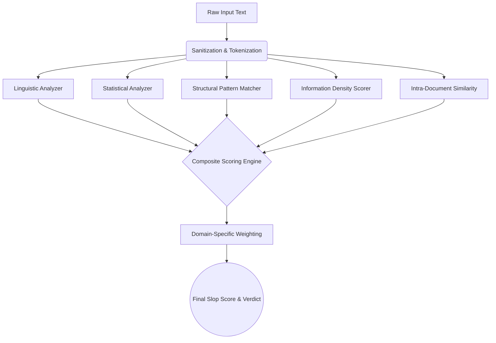

<div align="center">
  
  
  # 🔬 SLOP SCAN (Enterprise Edition)
  
  **The ultimate, privacy-first, zero-API detection engine for exposing AI-generated content across the internet.**

  [](#)
  [](#)
  [](#)
  [](#)
  [](#)

  <p align="center">
    <a href="#executive-summary">Executive Summary</a> •
    <a href="#core-architecture">Architecture</a> •
    <a href="#domain-tracks">Domain Tracks</a> •
    <a href="#api-reference">API Reference</a> •
    <a href="#future-roadmap">Future Roadmap</a>
  </p>
</div>

---

## 📑 Executive Summary

The internet is facing an unprecedented crisis of **"slop"**—low-quality, hollow, and repetitive AI-generated text flooding marketplaces, codebases, and academic journals. 

Traditional AI detectors attempt to solve this by querying expensive, black-box LLMs (like OpenAI or Anthropic). This introduces massive latency, high API costs, and critical data privacy violations for enterprise organizations.

**SLOP SCAN completely reinvents detection.** By relying exclusively on **pure statistical fingerprinting, advanced linguistic analysis, and structural pattern matching**, Slop Scan operates entirely locally. It catches AI generation by mathematically analyzing entropy, burstiness, and lexical density in milliseconds—guaranteeing 100% data privacy and zero external API dependencies.

---

## 🏗 Core Architecture

Slop Scan's engine is built on a highly modular, 5-stage pipeline designed for massive throughput and high accuracy.



### The 5 Engine Pillars
1. **Linguistic Analysis:** Calculates Type-Token Ratio (TTR), Hapax Legomena Ratio, and multiple readability indexes (Flesch-Kincaid, Gunning Fog, Coleman-Liau).
2. **Statistical Fingerprinting:** Measures Shannon Entropy on word frequencies and evaluates sentence length "burstiness" (identifying the uniform, monotonous sentence lengths typical of LLMs).
3. **Structural Pattern Matching:** Scans for overused AI vocabulary, hedging density ("It is important to note"), repetitive sentence openers, and em-dash abuse.
4. **Information Density:** Measures the ratio of actual concrete facts (named entities, raw numbers) vs. empty filler sentences.
5. **Similarity Detection:** Uses advanced TF-IDF vectorization and pairwise cosine similarity to detect documents that are unnaturally self-similar.

---

## 🎯 8 Specialized Domain Tracks

Generic AI detectors fail because a human-written Pull Request looks fundamentally different than a human-written blog post. Slop Scan solves this with 8 heavily optimized domain tracks:

| Track | Target | Detection Focus |
|-------|--------|-----------------|
| `Code & PRs` | GitHub, GitLab | Hollow commit messages, rubber-stamp code reviews, repetitive restatements. |
| `Docs & KBs` | Confluence, Notion | Circular explanations, lack of concrete examples, excessive verbosity. |
| `Hiring` | Workday, Lever | Generated cover letters, generic take-home assignments, over-indexed keywords. |
| `Comms` | Slack, Teams | Inflated, AI-expanded workplace messages and low signal-to-noise ratios. |
| `SEO` | WordPress, Medium | Content farm structures, listicle repetitions, and keyword stuffing. |
| `Academia` | Journals, Papers | Stylistic inconsistencies, fabricated citation structures. |
| `Marketplaces`| Amazon, Yelp | Review authenticity, sentiment uniformity across multiple posts. |
| `Social` | Twitter, LinkedIn | Synthetic text fingerprinting and engagement bait generation. |

---

## 💻 Developer API Reference

Slop Scan is built to be easily integrated into your existing enterprise infrastructure via our RESTful API.

### `POST /api/analyze`
Analyzes a single block of text and returns a deeply detailed mathematical breakdown.
```json
// Request
{
  "text": "In today's fast-paced digital landscape...",
  "track": "SEO"
}

// Response
{
  "overallScore": 87.4,
  "verdict": "critical",
  "confidence": 92.1,
  "flags": ["High AI Vocabulary Density", "Low Burstiness", "Excessive Filler"],
  "statistical": { "shannonEntropy": 4.12, "burstiness": 0.05 }
}
```

### `POST /api/batch`
Designed for CI/CD pipelines and massive document processing. Processes an array of texts concurrently.

---

## 🚀 Future Roadmap & Expansion

Slop Scan is currently in `v1.0`. The architecture is designed to scale into a multi-platform enterprise security suite. Our long-term roadmap includes:

### Q3 2026: Pipeline Automations
- **GitHub & GitLab Actions:** Native CI/CD integration to automatically block or flag Pull Requests that contain AI-generated, zero-context descriptions.
- **Slack App Integration:** Real-time channel scanning to warn managers when internal communications are devolving into AI-generated noise.

### Q4 2026: Browser & Endpoint Security
- **Chrome / Edge Extension:** A seamless overlay for recruiters and hiring managers to scan LinkedIn profiles and incoming resumes directly in the browser.
- **Local Language Models:** Integration of highly compressed, specialized local NLP models (running via WebAssembly) to detect deep-structural anomalies without sacrificing the strict offline-only privacy guarantee.

### Q1 2027: Enterprise Deployments
- **Self-Hosted Kubernetes Clusters:** Full Docker and Helm chart support for massive on-premise deployments at SOC2/HIPAA compliant financial and medical institutions.
- **Custom Enterprise Thresholds:** Allow organization admins to tune the weights of the 5 core analyzers based on their specific industry (e.g., Legal firms turning down the "Information Density" penalty while cranking up "Hedging Density").

---

## 🛠 Setup & Installation

### Requirements
- Node.js 18.0+
- npm or yarn

### Quickstart
```bash
# Clone the repository
git clone https://github.com/Kushal-Varshney/SLOP-SCAN.git

# Enter directory
cd slop-scan

# Install dependencies
npm install

# Start the high-performance local server
npm run dev
```
Open [http://localhost:3000](http://localhost:3000) to access the Transparency Dashboard.

---

## 🛡️ Enterprise Support & Licensing

Slop Scan is released under the MIT License for the open-source community. For enterprise licensing, custom track development, and dedicated support, please refer to the `ENTERPRISE.md` documentation or contact the core maintainers.

<div align="center">
  <br>
  <i>Built with absolute precision by Kushal Varshney.</i>
</div>
