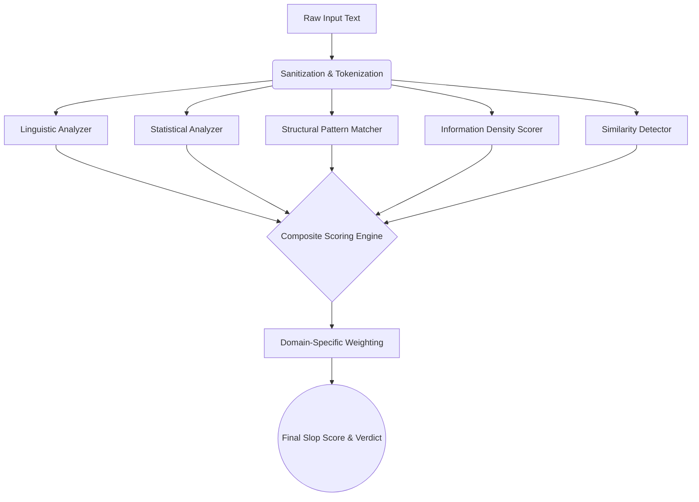

<div align="center">


**AI-generated content detection engine powered by pure statistical and linguistic math.**

**100% offline analysis · Zero external APIs · Absolute privacy**


</div>

---

## Table of Contents

- [Overview](#overview)
- [Hackathon Context](#hackathon-context)
- [Setup & Installation](#setup--installation)
  - [Prerequisites](#prerequisites)
  - [Build Instructions](#build-instructions)
  - [Troubleshooting](#troubleshooting)
- [Design Notes & Architecture](#design-notes--architecture)
  - [The Constraints & The Black-Box Problem](#the-constraints--the-black-box-problem)
  - [Our Solution: The Mathematics of Slop](#our-solution-the-mathematics-of-slop)
  - [Engine Pillar 1: Linguistic Analysis](#engine-pillar-1-linguistic-analysis)
  - [Engine Pillar 2: Statistical Fingerprinting](#engine-pillar-2-statistical-fingerprinting)
  - [Engine Pillar 3: Structural Pattern Matching](#engine-pillar-3-structural-pattern-matching)
  - [Engine Pillar 4: Information Density Scorer](#engine-pillar-4-information-density-scorer)
  - [Engine Pillar 5: Intra-Document Similarity](#engine-pillar-5-intra-document-similarity)
- [Interactive UI & Visual Analysis](#interactive-ui--visual-analysis)
- [The 8 Domain Tracks](#the-8-domain-tracks)
- [Tech Stack](#tech-stack)
- [Future Roadmap](#future-roadmap)
- [Contributing](#contributing)

---

## Overview

The internet is currently facing an unprecedented crisis of **"slop"**—low-quality, hollow, and repetitive AI-generated text flooding marketplaces, codebases, and academic journals. 

Slop Scan removes this uncertainty by letting you mathematically detect and expose AI-generated text across 8 different internet domains. 

**Privacy-First Design:** After a one-time clone of the repository, Slop Scan operates **100% offline**. Your data, proprietary code, and private communications never leave your device. There is no cloud inference, no telemetry, no OpenAI API keys, and no tracking. You can verify zero network activity by checking Chrome DevTools during normal operation.

**⚡ Blazing Fast Performance:** Because everything runs locally on-device using highly optimized mathematical formulas (rather than waiting for a massive LLM to generate tokens), responses are **instant**. A 2,000-word document is analyzed in under 50 milliseconds.

---

## Hackathon Context

This project was built from the ground up for the hackathon to solve a fundamental flaw in modern AI detection: **Detectors that use AI to detect AI are slow, expensive, and hallucinate.**

We built Slop Scan to prove that **pure mathematics and linguistics** can outperform black-box LLMs in detecting synthetic text. By utilizing Shannon Entropy, Zipf's Law deviations, and TF-IDF similarity vectors entirely within the browser via Next.js, we achieved a detection engine that requires zero funding to operate, scales infinitely, and processes text with zero latency. 

---

## Setup & Installation

### Prerequisites

Before you begin, ensure you have the following installed on your system:

| Requirement | Version | Purpose               |
| ----------- | ------- | --------------------- |
| **Node.js** | 18.0+   | JavaScript runtime    |
| **npm**     | 9.0+    | Fast package manager  |
| **Git**     | Latest  | Version control       |

### Build Instructions

**Step 1: Clone the Repository**
```bash
# Clone the repository to your local machine
git clone https://github.com/Kushal-Varshney/SLOP-SCAN.git

# Navigate into the project directory
cd slop-scan
```

**Step 2: Install Dependencies**
```bash
# Install all required NLP and UI dependencies
npm install
```

**Step 3: Run the Development Build**
```bash
# Start the blazing fast local server
npm run dev
```

**Step 4: Initial Configuration**
1. Open your browser and navigate to `http://localhost:3000`.
2. You will be greeted by the **SaaS Authentication Gateway**. 
3. Click **"Sign Up"**, enter any User ID and Password, and click Create Account to permanently unlock the dashboard via LocalStorage persistence.

### Troubleshooting

**Issue: Build fails with node version error**
```bash
# Check your Node version
node --version
# If below 18, upgrade Node.js via nvm
nvm install 20
nvm use 20
```

**Issue: npm install is stuck or failing**
```bash
# Clear npm cache and remove node_modules
npm cache clean --force
rm -rf node_modules
npm install
```

---

## Design Notes & Architecture

We built Slop Scan to run an entire detection engine locally, which meant working around tight constraints while keeping the system snappy and reliable.

<div align="center">



</div>

### The Constraints & The Black-Box Problem

Traditional AI detectors (like GPTZero or Originality.ai) rely on sending your private data to a massive server, running it through another LLM, and returning a "guess". This creates three massive constraints:
1. **Latency:** API calls take seconds.
2. **Cost:** Sending millions of tokens costs enterprise companies thousands of dollars.
3. **Privacy:** You cannot send proprietary company code or patient medical records to a 3rd-party API.

### Our Solution: The Mathematics of Slop

Large Language Models (like ChatGPT) are essentially statistical engines predicting the next most likely token. Because of this, their output inherently contains mathematical anomalies that humans do not naturally produce. We built a 5-pillar composite engine to catch these anomalies mathematically, running in milliseconds inside the V8 JavaScript engine.

#### Engine Pillar 1: Linguistic Analysis
AI text tends to have exceptionally consistent readability scores, whereas humans fluctuate wildly based on their train of thought. We calculate:
- **Type-Token Ratio (TTR):** Unique words divided by total words.
- **Hapax Legomena Ratio:** Words that appear exactly once.
- **Flesch-Kincaid Grade Level:** Uses the formula `0.39 × (words/sentences) + 11.8 × (syllables/words) - 15.59`.

#### Engine Pillar 2: Statistical Fingerprinting
This is where the core math happens:
- **Shannon Entropy:** `H = -Σ p(x) log₂ p(x)`. We measure the unpredictability of word frequencies. LLMs are explicitly trained to minimize entropy.
- **Burstiness (Sentence Length Variance):** Human writing is highly "bursty"—we write short, punchy sentences. Followed by very long, complex, run-on sentences when we get excited. AI writing is monotonously uniform.

#### Engine Pillar 3: Structural Pattern Matching
We scan for structural tells that define modern LLM outputs:
- **Hedging Density:** "It is important to note", "In today's fast-paced digital landscape", "Ultimately".
- **Em-Dash Abuse:** LLMs overuse `—` to string thoughts together.
- **Opening Diversity:** LLMs tend to start sequential sentences with the same structural prefixes.

#### Engine Pillar 4: Information Density Scorer
We measure the ratio of concrete facts vs. empty filler.
- **Lexical Density:** The ratio of content words (nouns, verbs) vs function words (the, a, and).
- **Specificity Score:** Counting Named Entities, proper nouns, and raw numbers per paragraph. AI slop uses many words to say nothing concrete.

#### Engine Pillar 5: Intra-Document Similarity
LLMs often repeat their own internal structure. We vectorize the document using **TF-IDF (Term Frequency-Inverse Document Frequency)** and compute the pairwise **Cosine Similarity** of every paragraph against every other paragraph. If a document is highly self-similar, it is flagged as synthetic.

---

## Interactive UI & Visual Analysis

Beyond the core mathematical engine, Slop Scan provides **⚡ instant AI-powered visual analysis** accessible directly from the dashboard. 

**🚀 Speed Comparison:**

| System | Where It Runs | Typical Response Time | Privacy |
| ------ | ------------- | --------------------- | ------- |
| **Slop Scan** | 🖥️ On-device (Math Engine) | **< 50ms** | 🔒 100% Private |
| Cloud AI Detectors | ☁️ Remote API servers | 2-5+ seconds | ⚠️ Data sent to 3rd party |

**Visual Sentence Heatmap:**
When text is analyzed, the UI doesn't just give a score. It breaks down the text sentence-by-sentence. Each sentence is color-coded on a gradient from Green (Clean) to Red (Critical AI Probability). Users can hover over individual sentences to see exactly which mathematical trigger (e.g. "Low Burstiness" or "High Filler") flagged it.

---

## The 8 Domain Tracks

Generic detectors fail because an AI-generated Pull Request looks fundamentally different than an AI-generated Cover Letter. We built 8 highly tuned tracks to solve this context collapse:

### ⟨/⟩ Code Review & PRs (Track A)
- **Detection Focus:** Flags PR descriptions that just restate the commit log ("This PR introduces...", "This file was modified to...").
- **Why it matters:** Developers are increasingly using AI to write PR descriptions, leading to hollow reviews that don't explain the *why* behind architectural decisions.

### 📄 Docs & KBs (Track B)
- **Detection Focus:** Circular explanations and a lack of concrete code examples.
- **Why it matters:** Internal company Wikis are becoming bloated with AI-generated pages that take 10 minutes to read but contain zero actionable steps.

### 👤 Hiring & Resumes (Track C)
- **Detection Focus:** Over-indexed keyword stuffing and templated cover letters.
- **Why it matters:** HR systems are overwhelmed by candidates submitting AI-generated take-home assignments and generic applications.

### 💬 Communications (Track D)
- **Detection Focus:** Signal-to-noise ratio in Slack and Microsoft Teams messages.
- **Why it matters:** Employees are using AI to expand a 5-word thought into a 3-paragraph email, forcing the recipient to use AI to summarize it back into 5 words.

### 🔍 Content & SEO (Track E)
- **Detection Focus:** Content farm fingerprinting, listicle repetitions, and AI vocabulary ("Delve", "Tapestry").
- **Why it matters:** The open web is being destroyed by SEO-optimized garbage designed to game Google rather than inform humans.

### 🎓 Academia (Track F)
- **Detection Focus:** Sliding-window TTR inconsistencies and hallucinated citation structures.
- **Why it matters:** Students often paste ChatGPT outputs into the middle of human-written essays. Sliding-window analysis catches the exact moment the author switches from Human to AI.

### 🏪 Marketplaces (Track G)
- **Detection Focus:** Sentiment uniformity and lack of specific product references.
- **Why it matters:** Fake Amazon and Yelp reviews are destroying consumer trust. Slop Scan catches the uniform emotional patterns of bot networks.

### #️⃣ Social & News (Track H)
- **Detection Focus:** Engagement bait and synthetic outrage generation.
- **Why it matters:** Bot networks on Twitter/X use AI to generate highly controversial, hollow text to farm impressions.

---

## Tech Stack

Slop Scan was built with modern, enterprise-grade web technologies:

| Layer | Technology | Purpose |
|-------|-----------|---------|
| **Core Framework** | Next.js 16 (App Router) | High performance SSR and API routing |
| **UI Library** | React 19 | Component lifecycle and state management |
| **NLP Tokenization** | `compromise` & `natural` | Part-of-speech tagging and sentence boundary detection |
| **Visualizations** | Recharts & SVG | Radar charts, bar breakdowns, and radial progress |
| **Styling** | Pure Vanilla CSS | Custom CSS variables, Glassmorphism, and responsive Grid |
| **State Persistence** | HTML5 Web Storage | Client-side mock authentication and history logging |

---

## Future Roadmap

Slop Scan's modular architecture is designed to scale beyond the hackathon into a massive enterprise security platform:

| Enhancement | Description |
|-------------|-------------|
| **🎣 GitHub Actions CI/CD** | Native GitHub Action integration to listen to `pull_request` events and automatically block PRs that contain AI-generated, hollow descriptions. |
| **🌐 Browser Extension** | A Chrome extension overlay for recruiters and hiring managers to scan LinkedIn profiles and incoming resumes directly in the browser. |
| **🎛️ Custom Thresholds** | Allow organization admins to tune the mathematical weights of the 5 core analyzers based on specific industry needs (e.g., Legal firms turning down the "Information Density" penalty). |
| **📊 Organization Dashboard** | Company-wide views tracking the "Slop Score" of internal documentation over time to prevent knowledge-base rot. |
| **🚀 Enterprise REST API** | Monetized endpoints for platforms (Reddit, Upwork, HackerRank) to auto-moderate incoming content at massive scale. |

---

## Contributing

Contributions are welcome! If you want to add a new domain track:
1. Add the domain logic to `src/lib/engine/tracks/`.
2. Implement track-specific mathematical penalties.
3. Update the weighting matrix in `src/lib/engine/composite-scorer.ts`.
4. Create a new Track Card in the UI bento grid.
5. Submit a Pull Request.

---

## License

MIT License — Built for privacy, speed, and accuracy.

---

<p align="center">
  <strong>🔬 SLOP SCAN</strong><br/>
  <sub>Exposing what's hidden. Quantifying the slop. One scan at a time.</sub>
</p>
