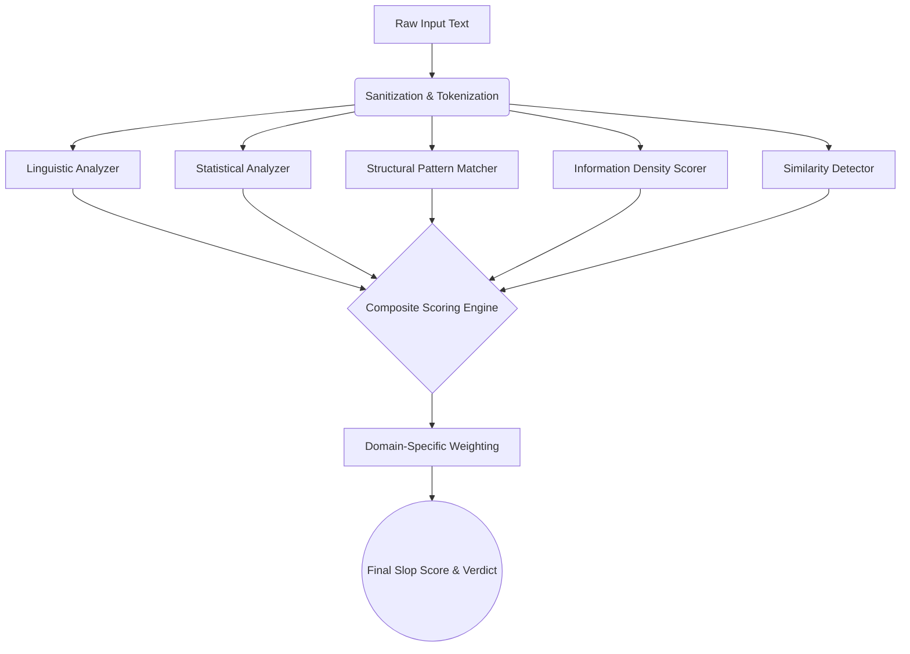

# 🔬 SLOP SCAN

> **The internet has a quality problem. Slop Scan is the solution.**

**Slop Scan** is a powerful, privacy-first AI-generated content detection engine. Unlike traditional AI detectors that rely on expensive, slow, and privacy-invasive external LLM APIs, Slop Scan operates entirely locally. It uses pure linguistic analysis, statistical fingerprinting, and structural pattern matching to expose hollow, low-quality AI-generated text ("slop").

---

## 🌟 Key Features & Tracks

Slop Scan features a modular engine with 8 specialized tracks, because AI text looks different in code reviews than it does in blog posts.

### ⟨/⟩ Code Review & PRs (Track A)
- **Hollow PR Detection** — Flags PR descriptions that just restate the commit log ("This PR introduces...").
- **Commit Repetition** — Detects generic, auto-generated commit messages.

### 📄 Docs & KBs (Track B)
- **Circular Explanations** — Catches documentation that uses many words but teaches nothing.
- **Example Density** — Scores the ratio of concrete code snippets/steps vs. filler paragraphs.

### 👤 Hiring & Resumes (Track C)
- **Cover Letter Templates** — Exposes heavily templated, AI-generated cover letters.
- **Specificity Scoring** — Checks for missing personal examples or real company names.

### 💬 Communications (Track D)
- **Signal-to-Noise Ratio** — Filters out inflated, AI-expanded messages in workplace channels (Slack/Teams).
- **Meeting Note Filler** — Detects generic meeting summaries.

### 🔍 Content & SEO (Track E)
- **Content Farm Fingerprinting** — Detects listicle repetitions and keyword stuffing.
- **AI Vocabulary Density** — Scans for words like "Delve", "Tapestry", and "Landscape".

### 🎓 Academia (Track F)
- **Stylistic Inconsistency** — Uses sliding-window Type-Token Ratio to detect when a student pasted ChatGPT into the middle of their essay.
- **Citation Format Validation** — Flags fabricated or hallucinated citation structures.

### 🏪 Marketplaces (Track G)
- **Review Authenticity** — Exposes fake AI-generated product reviews flooding marketplaces.
- **Sentiment Uniformity** — Detects unnatural emotional consistency across multiple reviews.

### #️⃣ Social & News (Track H)
- **Synthetic Text Detection** — Identifies bot networks and engagement bait in social feeds.

---

## 🏗️ Technical Architecture



### Tech Stack

| Layer | Technology |
|-------|-----------|
| **Frontend Framework** | Next.js 16 (App Router) |
| **UI Library** | React 19 |
| **Linguistic Engine** | `compromise` (NLP), `natural` (Tokenization) |
| **Charts & Vis** | Recharts |
| **Styling** | Pure CSS (Variables, Glassmorphism, CSS Grid) |
| **Deployment** | Vercel Ready (Zero-config edge functions) |

---

## 🛠️ Getting Started

### Prerequisites
- Node.js 18.0+
- `npm` package manager

### Installation

```bash
# Clone the repository
git clone https://github.com/Kushal-Varshney/SLOP-SCAN.git
cd slop-scan

# Install dependencies
npm install

# Start the high-performance local server
npm run dev
```

> 🌐 Access the dashboard at **http://localhost:3000**

### Running a Scan

1. Select a domain track from the dropdown (or use Auto-detect).
2. Paste the text you want to analyze.
3. Click **Analyze Text**.
4. View the results, including the Visual Sentence Heatmap, Score Breakdown, and Slop Gauge.

---

## 🎨 UI / UX Design

Slop Scan features a premium **"Soft Slate" Dark Mode** interface designed for high readability and a professional SaaS feel:

- **Glassmorphic Cards** — Deep slate backgrounds with subtle borders and shadow elevations.
- **Visual Sentence Heatmap** — Text is dynamically color-coded sentence-by-sentence based on AI probability (Green = Clean, Red = Critical AI).
- **Interactive Slop Gauge** — SVG radial progress bars with pulsing glow animations.
- **Bento Grid Layout** — Responsive 4x2 CSS grid for navigating the 8 domain tracks.
- **Mock SaaS Authentication** — Includes a realistic "Sign in to view history" lock screen to demonstrate enterprise platform capabilities.
- **Print-Ready Export** — Generate raw JSON reports of the mathematical breakdown.

---

## 📂 Project Structure

```text
slop-scan/
├── src/
│   ├── app/
│   │   ├── api/analyze/      # API Route for detection engine
│   │   ├── api/bakeoff/      # API Route for dataset benchmarks
│   │   ├── scan/page.tsx     # Main Scanner UI
│   │   ├── history/page.tsx  # Mock SaaS History UI
│   │   └── page.tsx          # Landing Dashboard
│   ├── components/
│   │   ├── AuthWrapper.tsx   # SaaS Authentication simulation
│   │   ├── HeatmapText.tsx   # Sentence highlighting engine
│   │   ├── SlopGauge.tsx     # Radial score visualization
│   │   └── ConfusionMatrix.tsx # Benchmark accuracy grid
│   └── lib/
│       ├── engine/           # 🧠 Core Math & NLP Logic
│       │   ├── linguistic-analyzer.ts
│       │   ├── statistical-analyzer.ts
│       │   └── composite-scorer.ts
│       └── types.ts          # Shared TypeScript interfaces
├── public/
└── package.json
```

---

## 🔮 Roadmap & Future Enhancements

Slop Scan's modular architecture is designed to scale into an enterprise-grade platform:

| Enhancement | Description |
|-------------|-------------|
| **🎣 GitHub Actions CI/CD** | Transform from manual scanning to automated: block Pull Requests that contain AI-generated, zero-context descriptions. |
| **🌐 Browser Extension** | An overlay for recruiters and hiring managers to scan LinkedIn profiles and incoming resumes directly in the browser. |
| **🎛️ Custom Thresholds** | Allow admins to tune the weights of the 5 core analyzers based on specific industry needs (e.g., Legal vs Marketing). |
| **📊 Team Dashboard** | Organization-wide views tracking the "Slop Score" of internal documentation over time. |
| **🚀 Enterprise API** | Monetized REST endpoints for platforms (Reddit, Upwork) to auto-moderate incoming content at scale. |

---

## 📄 License

MIT License — Built for privacy, speed, and accuracy.

---

<p align="center">
  <strong>🔬 SLOP SCAN</strong> — <em>Detection Engine</em><br/>
  <sub>Exposing what's hidden. Quantifying the slop. One scan at a time.</sub>
</p>
