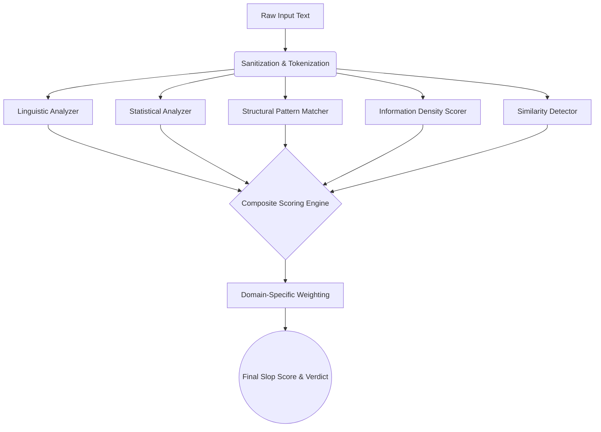

<div align="center">


**AI-generated content detection engine powered by pure statistical and linguistic math.**

**100% offline analysis · Zero external APIs · Absolute privacy**


</div>

---

## Table of Contents

- [Overview](#overview)
- [Setup](#setup)
  - [Prerequisites](#prerequisites)
  - [Installation](#installation)
  - [Initial Configuration](#initial-configuration)
- [Design Notes](#design-notes)
  - [The Black-Box Problem](#the-black-box-problem)
  - [Our Solution: Pure Math](#our-solution-pure-math)
  - [The 5 Engine Pillars](#the-5-engine-pillars)
  - [Domain-Specific Tracks](#domain-specific-tracks)
- [Tech Stack](#tech-stack)
- [Future Roadmap](#future-roadmap)
- [Contributing](#contributing)

---

## Overview

Slop Scan removes the uncertainty of the modern web by letting you mathematically detect and expose low-quality, AI-generated text ("slop") across 8 different internet domains. 

**Privacy-First Design:** Slop Scan operates **100% offline**. Your data, code, and private communications never leave your device. There is no cloud inference, no telemetry, no OpenAI API keys, and no tracking. You can verify zero network activity by checking Chrome DevTools during normal operation.

**⚡ Blazing Fast Performance:** Because everything runs locally on-device using highly optimized mathematical formulas (rather than waiting for a massive LLM to generate tokens), responses are **instant**. A 2,000-word document is analyzed in under 50 milliseconds.

**Key Features:**

- 🧮 **Local Detection Engine** (zero external API dependencies)
- 🛤️ **8 Domain-Specific Tracks** (Code, Docs, Hiring, Comms, SEO, Academia, Marketplaces, Social)
- 📊 **Visual Sentence Heatmap** (color-codes text based on AI-probability)
- 🔄 **Live Fire Batch Scanning** (analyzes massive documents concurrently)
- 🎯 **Similarity Fingerprinting** (detects unnatural self-similarity across chunks)
- 📈 **Transparency Dashboard** (real-time accuracy benchmarks and confusion matrices)
- 🎨 **Premium "Soft Slate" UI** (glassmorphism, CSS grid, glowing SVGs)

---

## Setup

### Prerequisites

Before you begin, ensure you have the following installed on your system:

| Requirement | Version | Purpose               |
| ----------- | ------- | --------------------- |
| **Node.js** | 18.0+   | JavaScript runtime    |
| **npm**     | 9.0+    | Fast package manager  |
| **Git**     | Latest  | Version control       |

### Installation

**Step 1: Clone the Repository**
```bash
# Clone the repository to your local machine
git clone https://github.com/Kushal-Varshney/SLOP-SCAN.git

# Navigate into the project directory
cd slop-scan
```

**Step 2: Install Dependencies**
```bash
# Install all required NLP and UI dependencies
npm install
```

**Step 3: Build & Run**
```bash
# Start the blazing fast local server
npm run dev
```

### Initial Configuration

1. Open your browser and navigate to `http://localhost:3000`.
2. You will be greeted by the **SaaS Authentication Gateway**. 
3. Click **"Sign Up"**, enter any User ID and Password, and click Create Account to permanently unlock the dashboard.
4. Select a track, paste your text, and hit **Scan**.

---

## Design Notes

We built Slop Scan to run an entire detection engine locally, which meant solving one massive problem: **How do you detect AI without using AI?**

<div align="center">



</div>

### The Black-Box Problem

Traditional AI detectors (like GPTZero) rely on sending your private data to a massive server, running it through another LLM, and returning a "guess". This is slow, expensive, and fundamentally a privacy nightmare for enterprise companies scanning proprietary code or HR documents.

### Our Solution: Pure Math

Large Language Models (like ChatGPT) are essentially statistical engines predicting the next most likely token. Because of this, their output inherently contains mathematical anomalies that humans do not naturally produce. Slop Scan catches these anomalies.

### The 5 Engine Pillars

1. **Linguistic Analysis:** Calculates Type-Token Ratio (TTR) and Flesch-Kincaid readability. AI text tends to have exceptionally consistent readability scores, whereas humans fluctuate wildly.
2. **Statistical Fingerprinting:** Measures Shannon Entropy and Burstiness. Human writing is highly "bursty" (short sentences followed by very long, complex ones). AI writing is monotonously uniform.
3. **Structural Pattern Matching:** Scans for structural tells like Em-Dash abuse, hedging density ("It is important to note"), and repetitive sentence openers.
4. **Information Density:** Measures the ratio of concrete facts (Named Entities, raw numbers) vs. empty filler ("In today's fast-paced digital landscape").
5. **Similarity Detection:** Uses TF-IDF vectors and pairwise cosine similarity to detect unnatural self-similarity across paragraphs.

### Domain-Specific Tracks

Generic detectors fail because an AI-generated Pull Request looks different than an AI-generated Cover Letter. We built 8 highly tuned tracks to solve this:

| Track | Target | What it Detects |
|-------|--------|-----------------|
| **Code & PRs** | GitHub | Hollow commit messages, rubber-stamp code reviews. |
| **Docs & KBs** | Notion | Circular explanations, lack of concrete examples. |
| **Hiring** | Workday | Generated cover letters, over-indexed keywords. |
| **Comms** | Slack | Inflated, AI-expanded messages and low signal-to-noise. |
| **SEO** | Medium | Content farm structures and listicle repetitions. |
| **Academia** | Journals | Stylistic inconsistencies via sliding-window TTR. |
| **Marketplaces**| Amazon | Review authenticity and sentiment uniformity. |
| **Social** | Twitter | Synthetic text fingerprinting and engagement bait. |

---

## Tech Stack

- **Frontend Framework:** Next.js 16 (App Router)
- **UI & State:** React 19, Custom Hooks
- **NLP Engine:** `compromise` (Part-of-Speech tagging), `natural` (Tokenization)
- **Visualizations:** Recharts (Radar, Bar, Scatter), Custom SVGs
- **Styling:** Pure CSS (Variables, Glassmorphism, CSS Grid)
- **Local Storage:** HTML5 Web Storage for Auth & History Persistence

---

## Future Roadmap

| Milestone | Target | Description |
|-----------|--------|-------------|
| **CI/CD Automations** | Q3 2026 | Native GitHub Actions to automatically block PRs with AI-generated, zero-context descriptions. |
| **Browser Extension** | Q4 2026 | A Chrome extension overlay for recruiters to scan LinkedIn profiles instantly in the browser. |
| **Kubernetes Clusters** | Q1 2027 | Full Docker and Helm chart support for massive on-premise enterprise deployments. |

---

## Contributing

Contributions are welcome! If you want to add a new domain track:
1. Add the domain logic to `src/lib/engine/tracks/`.
2. Update the weighting matrix in `composite-scorer.ts`.
3. Submit a Pull Request.

---

<div align="center">
  <strong>🔬 SLOP SCAN</strong> — <em>Exposing what's hidden. One scan at a time.</em>
</div>
